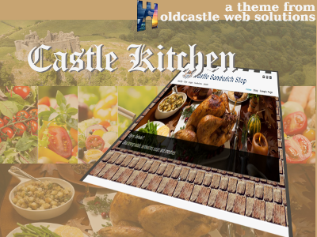

# Castle Kitchen
Castle Kitchen is a child theme of Qohelet, so requires the Qohelet theme to be installed in order to work. The slider option inside of the theme's banner will not work, unless the OCWS Slider plugin is installed, but the theme works without that plugin, if no slider is required.

## Version 0.1
The theme is now operational. The castellations at the top of the main portion can be changed, depending on screen size.

## License
The theme is released under the [GNU General Public License v3 or later](http://www.gnu.org/licenses/gpl-3.0.html). 

